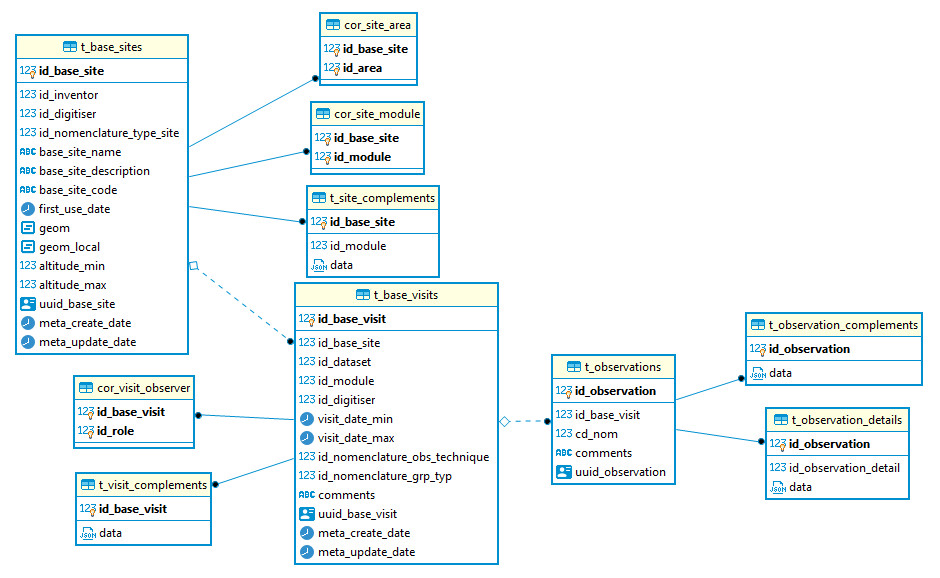

Développer un module monitorings GeoNature (Atelier du 25 mai 2023)
===================================================================

| source `Création d'un sous-module <https://github.com/PnX-SI/gn_module_monitoring/blob/master/docs/sous_module.rst>`_ (Documentation officielle du module monitorings)

--------------
Fonctionnement
--------------

Le module Monitoring est un module générique de gestion des données de protocoles de type suivis.
Il permet de générer des sous-modules (stockés dans la table gn_commons.t_modules) pour chaque protocole de suivi.

Au sein de ces sous-modules, nous retrouvons un niveaux d'information bien défini : 

- *(Facultatif)* **GROUPES DE SITES** Un groupe de sites est composé d'un ou plusieurs sites
- **SITES** (nom, type, localisation) Un site est composé d'une ou plusieurs visites
- **VISITES** (dates, observateurs) Une visite est composée d'une ou plusieurs observations
- **OBSERVATIONS** (espèce, dénombrement) Une observation est composée d'un ou plusieurs détails d'observation
- *(Facultatif)* **DETAIL DES OBSERVATIONS** Donne un détail à l'observation (permet d'ajouter un niveau supplémentaire dans la hierarchie)

Nous verrons plus en détail ces niveaux dans la partie `Configuration des niveaux <#id1>`_

.. NOTE::

    Le module est actuellement en refonte d'une partie de son modèle de données. Le fonctionnement est valable pour les versions <=0.5.0.

-------------------------------
Installer le module Monitorings
-------------------------------

1. Télécharger le projet à la racine de de l'utilisateur de votre GeoNatre (``cd``)

::

    wget https://github.com/PnX-SI/gn_module_monitoring/archive/X.Y.Z.zip
    unzip X.Y.Z.zip

2. Installer le module

::
    
    source geonature/backend/venv/bin/activate
    geonature install-gn-module gn_module_monitoring MONITORINGS
    sudo systemctl restart geonature

--------------------
Créer un sous-module
--------------------

Pour créer un sous-module, vous devez créer un dossier `<nom_de_votre_sous_module>` dans le dossier ``/home/`whoami`/gn_module_monitoring/contrib/``. ATTENTION, le nom de ce dossier constituera le ``module_code`` dans la table `gn_commons.t_modules`.

Tous les fichiers de configuration de base sont définis dans ``/home/`whoami`/gn_module_monitoring/config/monitoring/generic``.

Vous pouvez cependant surcoucher vos propres configurations spécifiques pour votre sous-module en créant des fichiers avec les mêmes noms dans ``/home/`whoami`/gn_module_monitoring/contrib/<nom_de_votre_sous_module>/``.

Les différents fichiers : 

* ``config.json`` `(configuration générale)`
* ``module.json`` `(configuration du module)`
* ``site.json`` `(configuration des sites)`
* ``group_site.json`` `(configuration des groupes de sites)`
* ``visit.json`` `(configuration des visites)`
* ``observation.json`` `(configuration des observations)`
* ``observation_detail.json`` `(configuration des détails des observations)`
* ``nomenclature.json`` `(pour l'ajout de nomenclatures spécifiques au sous-module)`
* ``synthese.sql`` `(vue pour la synchronisation avec la synthèse)`
* ``img.jpg`` `(image/vignette qui apparaitra dans l'accueil de Monitoring)`

Configuration générale
~~~~~~~~~~~~~~~~~~~~~~~~~

Les exemples cités sont à placer dans les fichiers correspondants.

- **L'Arboresence du sous-module** ``config.json``

Un premier lieu, il convient de bien définir les niveaux que vous aller utiliser pour votre sous-module.
Voici quelques exemples ci-dessous :

¤ Structure par défaut

.. code-block:: json

    {
    "tree": {
        "module": {
            "site": {
                "visit": {
                    "observation": null
                    },
                }
            }
        }
    }

¤ Struture en rajoutant le niveau `Détail de l'observation`

.. code-block:: json

    {
    "tree": {
        "module": {
            "site": {
                "visit": {
                    "observation": {
                        "observation_detail": null
                        },
                    },
                }
            }
        }
    }

¤ Struture en rajoutant le niveau `Groupe de sites`

.. code-block:: json

    {
    "tree": {
        "module": {
            "sites_group": {
                "site": {
                    "visit": {
                        "observation": {
                            "observation_detail": null
                            },
                        },
                    }
                }
            }    
        }
    }

¤ Struture en rajoutant le niveau `Groupe de sites`, sur le même niveau que les `Sites`

.. code-block:: json

    {
    "tree": {
        "module": {
            "site": {
                "visit": {
                    "observation": {
                        "observation_detail": null
                        },
                    },
                }
            }
        }
    }

- **Les Objets du module** ``module.json``

¤ Struture simple (varaibles obligatoires)

.. code-block:: json

    {
    "module_label":"Nom de votre sous-module",
    "module_desc":"Description de votre sous-module"
    }
    

- **Les Nomenclatures utilisées** ``nomenclature.json``

On peut également définir dans un fichier toutes les nomenclatures qui devront être installées pour faire fonctionner les champs de ce sous-module.

¤ Struture simple (définition d'un item spécifique pour le type de site)

.. code-block:: json

    {
    "nomenclatures": [
        {
        "type":"TYPE_SITE",
        "cd_nomenclature": "CODE_DE_MA_NOMENCLATURE",
        "mnemonique": "Mnémonique_de_ma_nomenclature",
        "label_default": "Ma nomenclature",
        "definition_default": "Description de ma nomenclature"
        }
    ]
    }

¤ Struture type (exemple pour le protocole `Chiro <https://github.com/PnX-SI/protocoles_suivi/tree/master/chiro>`_)

.. raw:: html

   

   
<a>big code</a>

.. code-block:: json

    {
    "types": [{
        "mnemonique": "CHIRO_ROOST_TYPE",
        "label_default": "Typologie des sites à chiroptères",
        "definition_default": "Typologie des sites à chiroptères"
    },{
        "mnemonique": "CHIRO_ADJUSTMENTS",
        "label_default": "Aménagements des sites à chiroptères",
        "definition_default": "Aménagements des sites à chiroptères"
    },{
        "mnemonique": "CHI_FREQUENTATION",
        "label_default": "Fréquentation des sites à chiroptères",
        "definition_default": "Fréquentation des sites à chiroptères"
    }
    ],
    "nomenclatures": [
        {
        "type": "TYPE_SITE",
        "cd_nomenclature": "CHI",
        "mnemonique": "Site chiroptère",
        "label_default": "Site chiroptère",
        "definition_default": "Site pour le suivi des chiroptères"
        },
        {"type": "CHIRO_ROOST_TYPE", "cd_nomenclature": "CHI_ARBRE", "mnemonique":"Arbre", "label_default":"Arbre", "definition_default":"Arbre"},
        {"type": "CHIRO_ROOST_TYPE", "cd_nomenclature": "CHI_BARRAGE", "mnemonique": "Barrage", "label_default":"Barrage", "definition_default":"Barrage"},
        {"type": "CHIRO_ROOST_TYPE", "cd_nomenclature": "CHI_BATIMENT", "mnemonique": "Bâtiment", "label_default":"Bâtiment", "definition_default":"Bâtiment"},
        {"type": "CHIRO_ROOST_TYPE", "cd_nomenclature": "CHI_CAVE", "mnemonique": "Cave", "label_default":"Cave", "definition_default":"Cave"},
        {"type": "CHIRO_ROOST_TYPE", "cd_nomenclature": "CHI_EBOULI", "mnemonique": "Ebouli", "label_default":"Ebouli", "definition_default":"Ebouli"},
        {"type": "CHIRO_ROOST_TYPE", "cd_nomenclature": "CHI_EGLISE", "mnemonique": "Église", "label_default":"Église", "definition_default":"Église"},
        {"type": "CHIRO_ROOST_TYPE", "cd_nomenclature": "CHI_FAÇADE", "mnemonique": "Façade", "label_default":"Façade", "definition_default":"Façade"},
        {"type": "CHIRO_ROOST_TYPE", "cd_nomenclature": "CHI_FOUR", "mnemonique": "Four", "label_default":"Four", "definition_default":"Four"},
        {"type": "CHIRO_ROOST_TYPE", "cd_nomenclature": "CHI_GARAGE", "mnemonique": "Garage", "label_default":"Garage", "definition_default":"Garage"},
        {"type": "CHIRO_ROOST_TYPE", "cd_nomenclature": "CHI_ARTIFICIEL", "mnemonique": "Gîte artificiel", "label_default":"Gîte artificiel", "definition_default":"Gîte artificiel"},
        {"type": "CHIRO_ROOST_TYPE", "cd_nomenclature": "CHI_GRANGE", "mnemonique": "Grange", "label_default":"Grange", "definition_default":"Grange"},
        {"type": "CHIRO_ROOST_TYPE", "cd_nomenclature": "CHI_GRENIER", "mnemonique": "Grenier", "label_default":"Grenier", "definition_default":"Grenier"},
        {"type": "CHIRO_ROOST_TYPE", "cd_nomenclature": "CHI_GROTTE", "mnemonique": "Grotte", "label_default":"Grotte", "definition_default":"Grotte"},
        {"type": "CHIRO_ROOST_TYPE", "cd_nomenclature": "CHI_MAISON", "mnemonique": "Maison", "label_default":"Maison", "definition_default":"Maison"},
        {"type": "CHIRO_ROOST_TYPE", "cd_nomenclature": "CHI_MINE", "mnemonique": "Mine", "label_default":"Mine", "definition_default":"Mine"},
        {"type": "CHIRO_ROOST_TYPE", "cd_nomenclature": "CHI_MUR", "mnemonique": "Mur", "label_default":"Mur", "definition_default":"Mur"},
        {"type": "CHIRO_ROOST_TYPE", "cd_nomenclature": "CHI_PANNEAU", "mnemonique": "Panneau", "label_default":"Panneau", "definition_default":"Panneau"},
        {"type": "CHIRO_ROOST_TYPE", "cd_nomenclature": "CHI_PLANCHER", "mnemonique": "Plancher", "label_default":"Plancher", "definition_default":"Plancher"},
        {"type": "CHIRO_ROOST_TYPE", "cd_nomenclature": "CHI_PONT", "mnemonique": "Pont", "label_default":"Pont", "definition_default":"Pont"},
        {"type": "CHIRO_ROOST_TYPE", "cd_nomenclature": "CHI_RUINE", "mnemonique": "Ruine", "label_default":"Ruine", "definition_default":"Ruine"},
        {"type": "CHIRO_ROOST_TYPE", "cd_nomenclature": "CHI_ROCHER", "mnemonique":"Rocher", "label_default":"Rocher", "definition_default":"Rocher"},
        {"type": "CHIRO_ROOST_TYPE", "cd_nomenclature": "CHI_TOIT", "mnemonique": "Toit", "label_default":"Toit", "definition_default":"Toit"},
        {"type": "CHIRO_ROOST_TYPE", "cd_nomenclature": "CHI_TOIT_VOLET", "mnemonique": "Toit et volet", "label_default":"Toit et volet", "definition_default":"Toit et volet"},
        {"type": "CHIRO_ROOST_TYPE", "cd_nomenclature": "CHI_TRANSFORMATEUR", "mnemonique": "Transformateur", "label_default":"Transformateur", "definition_default":"Transformateur"},
        {"type": "CHIRO_ROOST_TYPE", "cd_nomenclature": "CHI_TUNNEL", "mnemonique": "Tunnel", "label_default":"Tunnel", "definition_default":"Tunnel"},
        {"type": "CHIRO_ROOST_TYPE", "cd_nomenclature": "CHI_VOLET", "mnemonique":"Volet", "label_default":"Volet", "definition_default":"Volet"},
        {"type": "CHIRO_ROOST_TYPE", "cd_nomenclature": "CHI_AUTRE", "mnemonique":"Autre", "label_default":"Autre", "definition_default":"Autre"},
        {"type": "CHIRO_ROOST_TYPE", "cd_nomenclature": "CHI_INDETERMINE", "mnemonique":"Indéterminé" , "label_default":"Indéterminé" , "definition_default":"Indéterminé"},
        {"type": "CHIRO_ADJUSTMENTS", "cd_nomenclature": "CHI_ADJ_CHIROPTIERE", "mnemonique":"Fermeture avec chiroptière" , "label_default":"Fermeture avec chiroptière" , "definition_default":"Fermeture avec chiroptière"},
        {"type": "CHIRO_ADJUSTMENTS", "cd_nomenclature": "CHI_ADJ_NICHOIR", "mnemonique":"Nichoir" , "label_default":"Nichoir" , "definition_default":"Nichoir"},
        {"type": "CHIRO_ADJUSTMENTS", "cd_nomenclature": "CHI_ADJ_PONT", "mnemonique": "Pont restauré en intégrant les chiroptères" , "label_default": "Pont restauré en intégrant les chiroptères" , "definition_default": "Pont restauré en intégrant les chiroptères"},
        {"type": "CHI_FREQUENTATION", "cd_nomenclature": "forte", "mnemonique": "Importante (accès facile, proximité GR, bâti remarquable souvent visité)", "label_default": "Importante (accès facile, proximité GR, bâti remarquable souvent visité)" , "definition_default":"Importante (accès facile, proximité GR, bâti remarquable souvent visité)"},
        {"type": "CHI_FREQUENTATION", "cd_nomenclature": "moyenne", "mnemonique":"Moyenne (accessibilité à pied, proximité PR)", "label_default": "Moyenne (accessibilité à pied, proximité PR)" , "definition_default":"Moyenne (accessibilité à pied, proximité PR)"},
        {"type": "CHI_FREQUENTATION", "cd_nomenclature": "faible", "mnemonique":"Faible (site peu accessible, peu connu)", "label_default": "Faible (site peu accessible, peu connu)" , "definition_default":"Faible (site peu accessible, peu connu)"},
        {"type": "CHI_FREQUENTATION", "cd_nomenclature": "nulle", "mnemonique":"Nulle (pas de pénétrations enthropiques)", "label_default": "Nulle (pas de pénétrations enthropiques)" , "definition_default":"Nulle (pas de pénétrations enthropiques)"}
    ]
    }

.. raw:: html

   

Configuration des niveaux
~~~~~~~~~~~~~~~~~~~~~~~~~

- **Les Groupes de site** ``group_site.json``

- **Les Sites** ``site.json``

- **Les Visites** ``visit.json``

- **Les Observations** ``observation.json``

- **Les Détails d'une observation** ``observation_detail.json``

Configuration des exports
~~~~~~~~~~~~~~~~~~~~~~~~~

- **La Vue de synthèse** ``synthese.sql``

- **Paramétrage des exports** ``module.json``

Définir ses variables dans la configuration des niveaux
~~~~~~~~~~~~~~~~~~~~~~~~~~~~~~~~~~~~~~~~~~~~~~~~~~~~~~~

- **Les variables génériques (par défaut)**

- **Les variables additionnelles (créées sur mesure)**

- **Les variables dynamiques**

Gérer les permissions (<= 0.5.0)
~~~~~~~~~~~~~~~~~~~~~~~~~~~~~~~~

---------------------------------
Dépot des projets de sous-modules
---------------------------------

Un repository GitHub a été mis en place par l'équipe de développement pour recenser tous les projets de sous-modules qui ont été paratagés à la communauté.

Le lien du dépot : https://github.com/PnX-SI/protocoles_suivi
